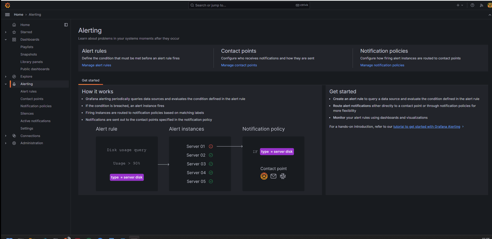

# Desafio Magoya

## App-color

Esta aplicación en Go muestra un color en una página web, el mismo es definido por la variable de entorno `BACKGROUND_COLOR`.
El archivo `app-color.yaml` contiene el manifiesto de kubernetes para desplegar la aplicacion en un cluster EKS y de esa manera alternar entre los colores de fondo de la aplicacion al dirigirse a green o red

## Github Actions

El archivo `.github/workflows/app_color_test_build_img_deploy_on_eks.yml` contiene el pipeline de github actions que se encarga de testear la aplicacion, construir la imagen docker, subirla a dockerhub y desplegarla en el cluster EKS.

El archivo `.github/workflows/monitoring.yml` contiene el pipeline de github actions que se encarga de desplegar la configuracion de prometheus y grafana en el cluster EKS.

## Terraform

la carpeta `terraform` contiene el codigo necesario para crear un cluster EKS en AWS, el mismo se crea con nodegroups privados y publicos (spot) segun se defina en el archivo `variables.tf`

## Animacion de la aplicacion

## Animacion de alertas (los consumos de cpu y memoria de la aplicacion son infimos al tratarse de una aplicacion en go muy simple)

